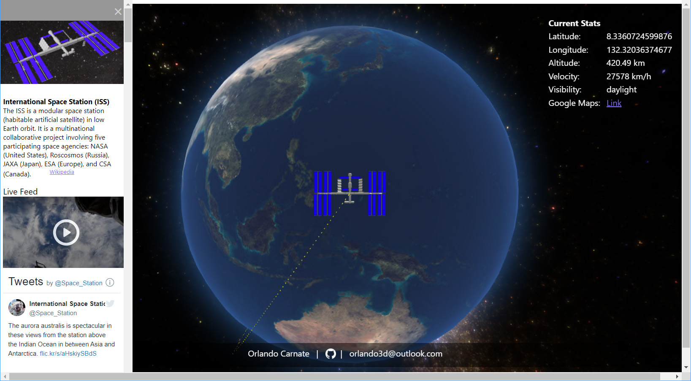

# ISS Tracker using Three.js
An International Space Station Tracker. Visualized using Three.js framework which uses Open Notify's ISS API to retrieve the current ISS location and place it in proper orbit over the Earth in real-time.
ISS was modeled in 3DS Max and exported as a GLTF file.

Screenshot

## ISS Tracker API

http://open-notify.org/Open-Notify-API/ISS-Location-Now/

## Converting Latitude and Longitude to Cartesian Coordinates

https://stackoverflow.com/questions/1185408/converting-from-longitude-latitude-to-cartesian-coordinates

## Main NPM Packages
* Three.js

## Installation
* With node.js and npm installed, you can clone my repository then in the root folder run the command `npm install`
* run with the command `npm run dev`

## Custom Shaders
The Earth's atmospheric glow was made as a custom shader. I learned how to do it from [Chris Courses Youtube tutorial](https://youtu.be/vM8M4QloVL0)
