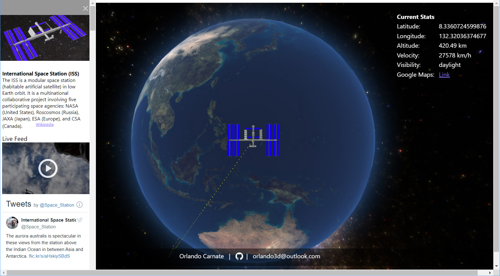

# ISS Tracker using Three.js
An International Space Station Tracker. Visualized using Three.js framework which uses Open Notify's ISS API to retrieve the current ISS location and place it in proper orbit over the Earth in real-time.
ISS was modeled in 3DS Max and exported as a GLTF file.

## Angular 22 Migration Plan

The application will be migrated from the current Webpack/imperative JavaScript implementation to an Angular 22 standalone application. The existing Three.js visualization and static model assets will be retained while responsibilities are split into focused components and services.

1. Create the Angular 22 standalone application shell, configure the existing model, texture, image, and shader assets, and replace the Webpack build pipeline.
2. Add typed ISS domain models and an `IssApiService` as the only owner of Open Notify API calls.
3. Poll Open Notify every five seconds and retain the received samples in an in-memory trajectory buffer. This buffer will drive smooth ISS movement and the rendered orbital path.
4. Convert the page shell into standalone Angular components for the application, ISS statistics, sidebar, and footer. Angular bindings will replace direct DOM mutation and inline event handlers.
5. Create an `IssSceneComponent`, loaded from the main application template, to own the Three.js canvas lifecycle. A supporting scene service will encapsulate renderer setup, GLTF loading, animation, and GPU-resource disposal.
6. Load the GLTF model once, position it from the live trajectory stream, and calculate orbital radius from the Earth sphere radius and the documented 408 km ISS altitude: `earthRadiusScene * (1 + altitudeKm / 6371)`.
7. Align the equirectangular Earth texture in its shader rather than rotating the Earth mesh or offsetting ISS coordinates.
8. Restore the initial historical trajectory using the Where the ISS At positions endpoint, while keeping Open Notify as the live source.
9. Add a selectable hit sphere around the model: selecting it follows the ISS, and manual camera orbit disables following.
10. Add focused tests for API mapping, trajectory buffering, coordinate projection, and component behavior before updating the deployment pipeline.

### Agreed data behavior

- **Live source:** [Open Notify ISS Location Now](http://open-notify.org/Open-Notify-API/ISS-Location-Now/)
- **Polling cadence:** every five seconds
- **Deployment protocol:** HTTP, because Open Notify is available only over HTTP
- **Trajectory:** collected in the browser from live API samples
- **Historical trajectory:** fetched once from Where the ISS At for the six hours ending at the first live Open Notify timestamp
- **Model motion:** animated through collected trajectory samples while continuing to receive live position updates
- **Orbit scale:** proportional to the Earth sphere radius and the documented 408 km ISS altitude, because Open Notify does not provide altitude
- **Unavailable telemetry:** velocity and visibility are removed because Open Notify does not provide them

Screenshot

## ISS Tracker API

http://open-notify.org/Open-Notify-API/ISS-Location-Now/

## Converting Latitude and Longitude to Cartesian Coordinates

https://stackoverflow.com/questions/1185408/converting-from-longitude-latitude-to-cartesian-coordinates

## Main NPM Packages
* Three.js

## Installation
* With node.js and npm installed, you can clone my repository then in the root folder run the command `npm install`
* run with the command `npm run dev`

## Custom Shaders
The Earth's atmospheric glow was made as a custom shader. I learned how to do it from [Chris Courses Youtube tutorial](https://youtu.be/vM8M4QloVL0)
